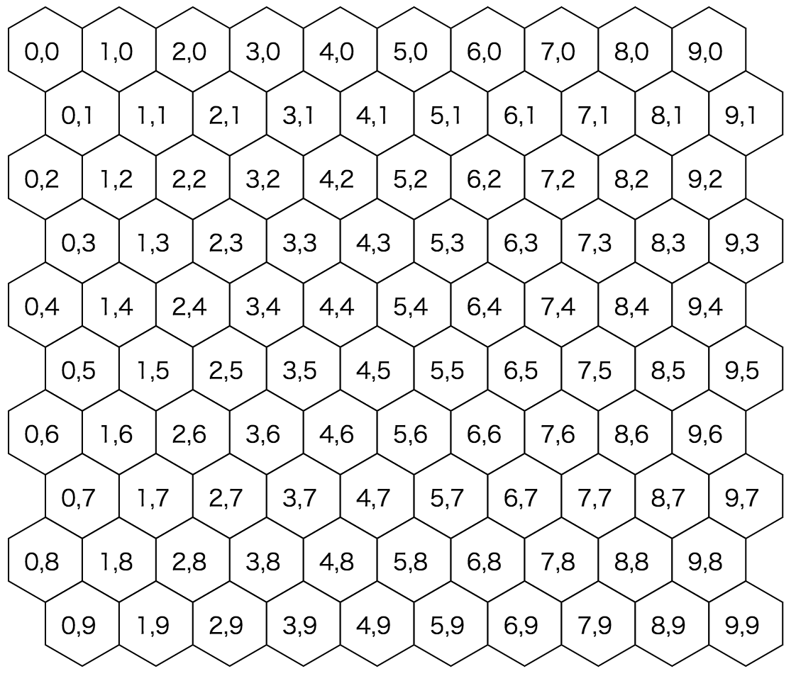
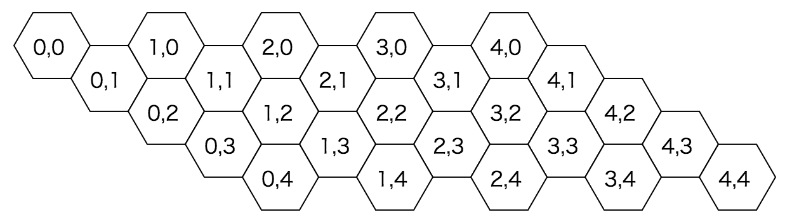

# react-hex [](https://travis-ci.org/airtoxin/react-hex)

draw svg hexagonal grid with react

## Install

`$ npm i react-hex`

## Example

```javascript
import React from 'react';
import ReactDom from 'react-dom';
import Hex, { gridPoints } from 'react-hex';

const Hexes = () => {
  const hexes = gridPoints('pointy-topped', 100, 100, 10, 25, 25).map(({ props }) => (
    <Hex {...props} fill="white" stroke="black" />
  ));

  return (
    <svg width="500" height="500">
      {hexes}
    </svg>
  );
};

ReactDom.render(<Hexes />); document.getElementById('example'));
```


More examples, see [Storybook](https://airtoxin.github.io/react-hex).

## Documents

### `<Hex type={} x={} y={} size={}/>` (default exported)

Main React component of hex.

################## Insert props table here

```js
import Hex from 'react-hex';

<Hex type="pointy-topped" x={0} y={0} size={50} />
```

### `gridPoint(oType, oX, oY, size, gridX, gridY)`

__return: `{ props: { type, x, y, size }, gridX, gridY }`__

Helper function to calculate hex location in grid.
`props` field in returning object of this function can use for props of `Hex` component.

(prefix `o` means original.)

################## Insert props table here

```js
import Triangle, { gridPoint } from 'react-hex';

const { props } = gridPoint('pointy-topped', 0, 0, 50, 3, 4);
```

### `gridPoints(oDirection, oX, oY, size, girdWidth, gridHeight)`

__return: `[ { props: { type, x, y, size }, gridX, gridY }, ... ]`__

Helper function to bulk calculate hexes location of grid.

(prefix `o` means original.)

################## Insert props table here

```js
import Hex, { gridPoints } from 'react-hex';

const triangles = gridPoints('pointy-topped', 100, 100, 50, 5, 5).map(({ props, gridX, gridY }) = (
  <Hex key={`${gridX}-${gridY}`} {...props}/>
));
```

__pointy topped grid coordinate x,y__



__flat topped grid coordinate x,y__



## License

MIT
